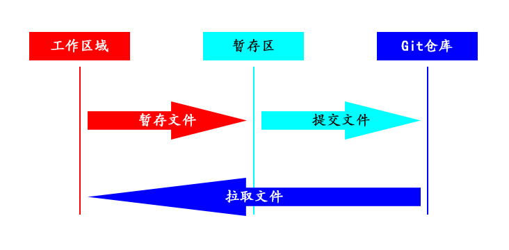

# Recorde the knowledge of Git and how to use it
* [Git 基础](#base)
	* [Git的三种状态](#status)
	* [Git的三个工作区域](#work_area)
	* [Git配置](#config)
* ## <span id='base'>Git 基础</span>
	* ### <span id='status'>Git的三种状态</span>
		* 已提交(commited)
			* 表示文件已提交到本地的数据库
		* 已修改(modified)
			* 表示文件已经修改，但是没有暂存
		* 已暂存(staged)
			* 表示文件已暂存，但没提交到本地数据库，包含在下次提交中
	* ### <span id='work_area'>Git的三个工作区域</span>: 
		* 工作目录
			* 此目录保存的是从git仓库中拉取的文件，并用于操作的文件
		* 暂存区域
			* 在工作目录中修改后并暂存文件，会处在暂存区域，git commit就是提交此区域的文件到git仓库中
		* git仓库(这里指本地仓库，下同)
			* 保存项目数据和数据库的地方
		
		#### 在git中工作流程
		1. 在工作目录中修改文件
		2. 将修改的文件放到暂存区域
		```
			git add .(all)/filename
		```
		3. 将暂存的文件提交到git仓库
		```
			git commit -m "commit information"
		```
	* ### <span id='config'>Git配置</span>	
		* #### 配置用户信息
			**git的每次提交都会使用这些信息，且会写入到每一次提交中**
			```
			 git config --global user.name "your name"
			 git config --global user.email "your email"
			```
			**如果配置用户信息使用了--global选项，那么git每次操作都会使用这些信息**
		* #### 配置编辑器
			```
			 git config --global core.editor "editor root path"
			```	
		* #### 查看配置信息
			```
			 git config --list || git config configname
			```	
			**Windows用户可以在c/user/administrator/.gitconfig中找到配置信息**
git的状态可以通过命令行git status查看文件的具体状态(Windows系统下通过cmd查看)	


++++++++